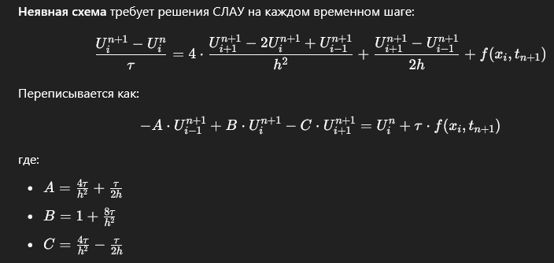

Для **неявной схемы (implicit method)** решения уравнения теплопроводности:

$$
\frac{\partial U}{\partial t} = 4\frac{\partial^2 U}{\partial x^2} + \frac{\partial U}{\partial x} + f(x, t)
$$

мы будем использовать **двухслойную схему с полной неявной аппроксимацией по времени**.

---

## 🔧 Подход



**Неявная схема** требует решения СЛАУ на каждом временном шаге:

$$
\frac{U_i^{n+1} - U_i^n}{\tau} = 4 \cdot \frac{U_{i+1}^{n+1} - 2U_i^{n+1} + U_{i-1}^{n+1}}{h^2}
+ \frac{U_{i+1}^{n+1} - U_{i-1}^{n+1}}{2h}
+ f(x_i, t_{n+1})
$$

Переписывается как:

$$
- A \cdot U_{i-1}^{n+1} + B \cdot U_i^{n+1} - C \cdot U_{i+1}^{n+1} = U_i^n + \tau \cdot f(x_i, t_{n+1})
$$

где:

* $A = \frac{4\tau}{h^2} + \frac{\tau}{2h}$
* $B = 1 + \frac{8\tau}{h^2}$
* $C = \frac{4\tau}{h^2} - \frac{\tau}{2h}$

---

## 🧮 Реализация на Python

```python
import numpy as np

def solve_heat_equation_implicit(f_func, L=1.0, T=1.0, Nx=100, Nt=1000):
    h = L / Nx
    tau = T / Nt
    x = np.linspace(0, L, Nx + 1)
    t = np.linspace(0, T, Nt + 1)

    u = np.zeros((Nt + 1, Nx + 1))
    u[0, :] = (1.3 * x**2 + 1.2) * np.sin(np.pi * x)

    alpha = 4.0

    # Коэффициенты матрицы
    A = (alpha * tau / h**2) + (tau / (2*h))
    B = 1 + 2 * alpha * tau / h**2
    C = (alpha * tau / h**2) - (tau / (2*h))

    # Матрица коэффициентов (трехдиагональная)
    a = -A * np.ones(Nx - 1)
    b = B * np.ones(Nx - 0)
    c = -C * np.ones(Nx - 1)

    from scipy.linalg import solve_banded

    ab = np.zeros((3, Nx - 0))  # трехдиагональный вид для solve_banded
    ab[0, 1:] = c  # верхняя диагональ
    ab[1, :] = b   # главная диагональ
    ab[2, :-1] = a  # нижняя диагональ

    for n in range(Nt):
        rhs = u[n, 1:Nx] + tau * np.array([f_func(xi, t[n+1]) for xi in x[1:Nx]])

        # Граничные условия (Neumann: производная = 0 => "зеркальное" значение)
        u[n+1, 0] = u[n+1, 1]
        u[n+1, Nx] = u[n+1, Nx - 1]

        # Правая часть с учетом граничных условий
        rhs[0] += A * u[n+1, 0]
        rhs[-1] += C * u[n+1, Nx]

        # Решаем СЛАУ
        u[n+1, 1:Nx] = solve_banded((1, 1), ab, rhs)

    return x, t, u
```

---

### 🧪 Пример использования:

```python
f_zero = lambda x, t: 0.0
x, t, u = solve_heat_equation_implicit(f_zero, Nx=100, Nt=1000)
visualize_heat_equation(x, t, u)
```

---

### ✅ Преимущества неявной схемы:

* **Безусловно устойчива** по сравнению с явной схемой
* Можно использовать большие шаги по времени

---

Если хочешь — могу заменить `solve_banded` на ручный метод прогонки (метод трёхдиагональной матрицы).
